# Interim Report: Topology-Aware Deformation of Gaussian Splats

Author: VENKET, Hrsh

Student ID: 21247584 

The objective of this work is to create a useable system by which Gaussian splats taken from a non-professional setup can be deformed while minimising artificats. My solution to this is bind gaussian splats to a proxy mesh in a topologically aware manner so when an artist can simply deform the proxy mesh to deform a splat without creating artifacts. I have built a fully working system that allows artists to apply topologically-aware deformations to 3D Gaussian Splats on blender.

### Demonstration on Casually Captured Data

All examples shown in this report were produced from a splat captured on a Samsung Galaxy S23 using fewer than 150 images. This is deliberately below the quality threshold of professional multi-camera capture rigs, in line with the design goal that the addon should be usable with amateurishly captured splats, not just studio-quality data. Below are screenshots of this naively caputured splat, and one arm isolated as a demonstration of this approach. The arm is shown using a representation of the splat (rendered as vertices at gaussian centers) and a proxy mesh of the same. The splat and proxy mesh are generated using software by KIRI Engine, and the tooling I have built is onto a fork by the same company.

{height=4in}
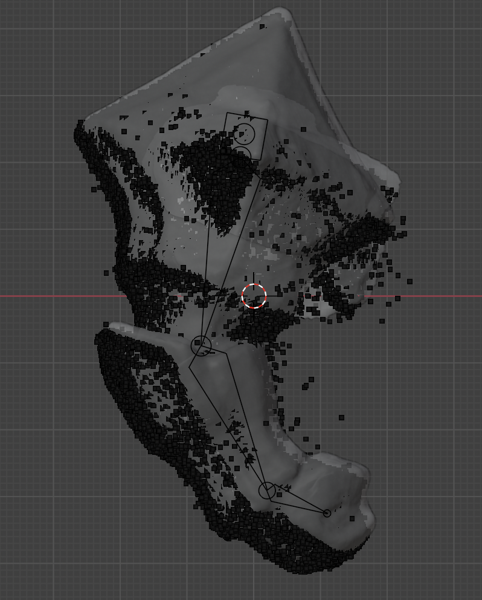{height=4in}

## Achievement

### Proxy-Mesh Binding with Topology-Aware Assignment

The core operation of the addon is binding a 3D Gaussian Splat to a proxy mesh such that deformations applied to the mesh transfer naturally to the splat. The fundamental unit of this binding is the assignment of each gaussian to a mesh face (triangle). Once bound, any deformation of that triangle is propagated to its assigned gaussians.

A naive approach to this assignment is to bind each gaussian to the triangle whose surface is closest to the gaussian's centre. This is straightforward to compute using barycentric coordinates — effectively an orthogonal projection of each gaussian centre onto its nearest triangle. However, this approach fails in geometrically ambiguous regions. For example, in the case of a hand, gaussians representing one finger may be geometrically closer to mesh faces belonging to an adjacent finger, resulting in incorrect assignments that produce severe artifacts during deformation.

To address this, a priority-queue-based assignment scheme was implemented. The queue ranks candidate assignments using two metrics: first, the difference in distance between the closest and second-closest triangles (a measure of assignment ambiguity), and second, a penalty based on the topological distance on the mesh from gaussians that have already been assigned. On the first iteration, only the distance-difference metric is used. In subsequent iterations, the topological penalty is introduced and the queue is updated accordingly. This encourages spatially coherent assignments that respect the mesh's surface topology rather than relying purely on Euclidean proximity.

### TBN-Space Deformation Transfer

Once a gaussian is bound to a triangle, deformations are transferred from the mesh to the gaussian across three channels.

For position, the gaussian's location is stored in TBN (tangent, bitangent, normal) coordinates relative to its bound triangle. When the triangle deforms, the gaussian's position is recomputed from these stored TBN coordinates, ensuring it moves consistently with the triangle surface.

For rotation, a rotation delta relative to the gaussian's original orientation at bind time is maintained. Using the original delta rather than an incremental update ensures idempotency — the result is the same regardless of how many intermediate update checks have occurred.

For scaling, TBN ratios between the gaussian's dimensions and the triangle's dimensions are stored at bind time. On deformation, these ratios are used to apply an affine transform to the gaussian, scaling it proportionally to changes in the triangle.

### Adaptive Gaussian Splitting via EVSplitting

A further problem arises during deformation: large gaussians bound to small triangles scale disproportionately fast, producing visual artifacts in heavily deformed regions. To mitigate this, an adaptive splitting step was introduced at bind time.

The splitting condition is borrowed from prior work on mesh-aware gaussian splatting at train time: if a gaussian's largest dimension exceeds a lambda multiplied by the circumcircle radius of its target triangle, it is split before binding. Since the original formulations of this condition are designed for use during training (where gradients can guide the split), a different mechanism is needed for post-hoc splitting in Blender. The addon uses the closed-form, visually consistent splitting method introduced in EVSplitting (SIGGRAPH Asia 2024), which provides an analytically exact decomposition of a gaussian into sub-gaussians. The alpha channel is maintained during splitting to correctly handle transparency.

Below are the closed-form solutions for splitting these gaussians. For convenience of notation, we can think of them as left and right gaussians.

The positions $\mu_{l}$ and $\mu_{r}$ of the new gaussians defined as follows:
$$\mu_l = \mu_0 - \frac{\mathbf{L}_0 D}{\tau C_l}$$
$$\mu_r = \mu_0 + \frac{\mathbf{L}_0 D}{\tau C_r}$$

Their alpha channel or opacity are defined: 
$$\alpha_k = \alpha_0 C_k, \quad k \in \{l, r\}$$

Similarly, their covariance matrices $\Sigma_{l}$ and $\Sigma_{r}$ are defined:
$$\Sigma_l = \Sigma_0 + \frac{\mathbf{L}_0 \mathbf{L}_0^T}{\tau^2} \left( \frac{d_0 D}{\tau C_l} - \frac{D^2}{C_l^2} \right)$$
$$\Sigma_r = \Sigma_0 - \frac{\mathbf{L}_0 \mathbf{L}_0^T}{\tau^2} \left( \frac{d_0 D}{\tau C_r} + \frac{D^2}{C_r^2} \right)$$

Where the auxiliary quantities are defined as follows. $C_l$ and $C_r$ are the spatial weights representing the fraction of the original gaussian's probability mass on each side of the splitting plane:

$$C_l = C_r =  \frac{1}{2} \left(1 - \operatorname{erf}\left(\frac{d_0}{\sqrt{2}\tau}\right)\right)$$

where $\operatorname{erf}$ is the Gauss error function. When the splitting plane passes through the gaussian centre, $C_l = C_r = 0.5$ and the split is symmetric. As the plane moves to one side, the weight on that side approaches zero and the other approaches one.

$D$ is a density factor equal to the value of the one-dimensional unit gaussian pdf evaluated at the normalised distance of the splitting plane from the gaussian centre:

$$D = \frac{1}{\sqrt{2\pi}} \exp\left(-\frac{d_0^2}{2\tau^2}\right)$$

This term governs the magnitude of the position and covariance corrections. When the plane is far from the gaussian centre, $D \to 0$ and the child gaussians converge to the original, reflecting the fact that no meaningful split occurs.

$\mathbf{L}_0$ is the projection of the original covariance matrix onto the splitting plane normal $\mathbf{n}$:

$$\mathbf{L}_0 = \Sigma_0 \mathbf{n}$$

This vector captures both the spread of the gaussian along $\mathbf{n}$ and the correlations between the split direction and the remaining axes. It ensures the position and covariance updates are correct for anisotropic gaussians whose principal axes are not aligned with the splitting plane.

$\tau$ is the standard deviation of the original gaussian along the splitting plane normal:

$$\tau = \sqrt{\mathbf{n}^T \Sigma_0 \mathbf{n}}$$

Finally, $d_0$ is the signed distance from the original gaussian centre $\mu_0$ to the splitting plane $P(\mathbf{n}, d)$:

$$d_0 = \mathbf{n} \cdot \mu_0 + d$$

The solution is derived by requiring each child gaussian to independently conserve the zeroth, first, and second-order moments of the original gaussian's opacity distribution over its own half-space. This yields a system of integral tensor equations with a unique closed-form solution. The SH coefficients for view-dependent colour are copied directly to both children, as the positional offset between child and parent is negligible relative to typical camera distances.

| Highlighted artifacts | Deformed splat (no splitting) |
|:---------------------:|:-----------------------------:|
| 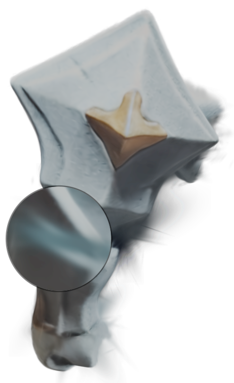{height=1.9in} | 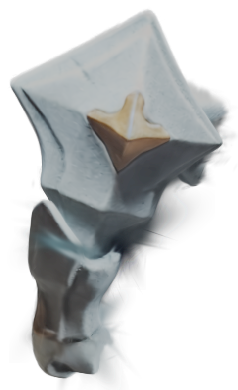{height=1.9in} |
| 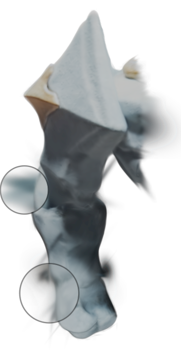{height=1.9in} | 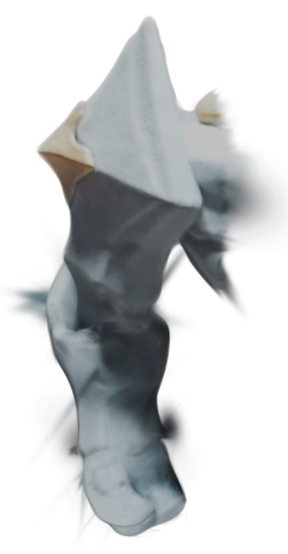{height=1.9in} |
| 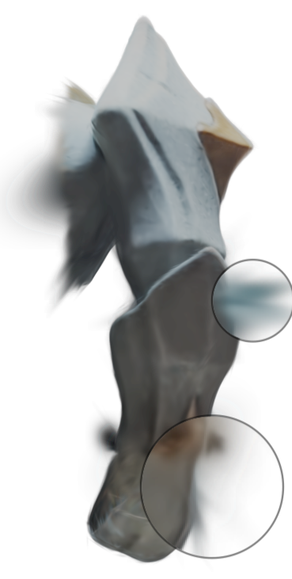{height=1.9in} | 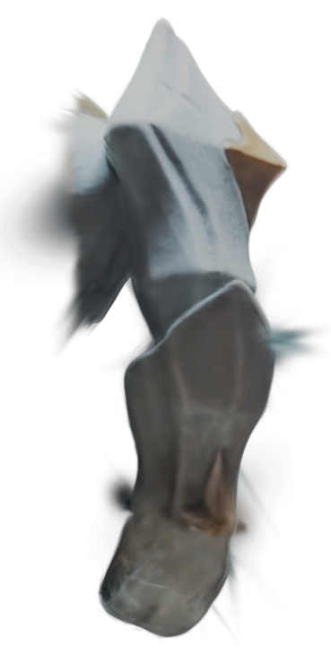{height=1.9in} |

: Deformation artifacts produced when large gaussians are bound to small triangles, shown on the deformed splat before splitting. The left column marks regions of stretching and bloating with magnified call-outs; the right column shows the corresponding unannotated view. Rows are three camera views of the same splat.

### Multi-Scale Lambda Control (Global vs. Local)

An overly strict splitting threshold (lambda) can cause the total gaussian count to explode, particularly when the proxy mesh is dense. In practice, most regions of a splat do not require fine-grained deformability -- only areas near joints or regions of high curvature benefit from smaller, more numerous gaussians. This mirrors conventional mesh-based workflows where artists add additional edge loops near elbows and joints for smoother deformation.

To address this, the addon supports two levels of lambda control. A lenient global lambda applies a conservative splitting threshold across the entire splat, while a strict local lambda can be applied to user-marked regions where high deformability is needed. This allows artists to concentrate computational cost where it matters, following the same intuition they already use when preparing meshes for skinning. As pictured below, the UI uses existing blender selection tools to mark regions with a strict lambda. For future iterations of this, as needed, it may be useful to allow users to 'paint' a lambda onto the splat or otherwise mark different local lambda values.

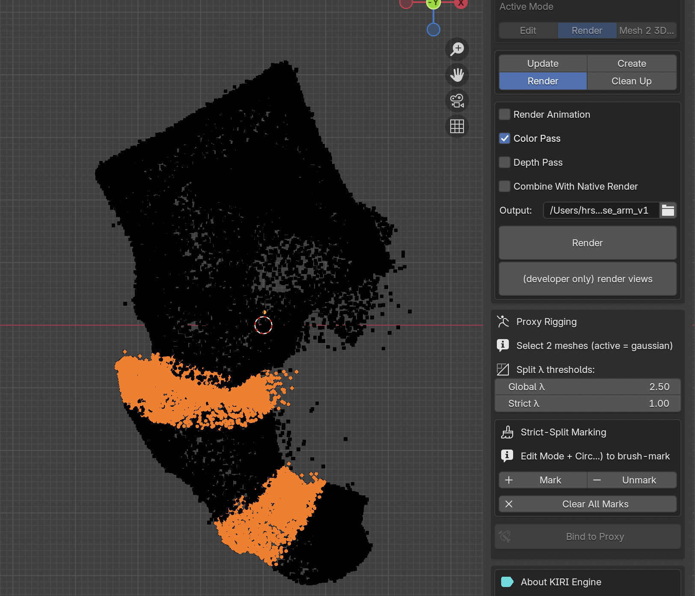

### Design Goals

A large aspect of designing this plugin has been integrating it with existing blender tools. Although there are separate buttons to mark lambda and do certain gassian-splat related operations, all selection is done using regular blender UI in edit mode. Further, the artist can use all existing methods for mesh deformation to apply similar operations to gaussians. Control remains squarely with them for how they want to use different operations and adjust the Splat by adding or removing gaussians.

## Evidence

### Qualitative Comparison: Naive Binding vs. Priority Queue Assignment

The topology-aware priority queue assignment was developed specifically to handle cases where naive closest-triangle binding produces incorrect assignments. Regions with interleaved geometry such as fingers are a representative failure case for the naive approach. Evidence for the improvement is currently qualitative, based on visual inspection of deformed splats.

### Deformation Artifacts Before and After Gaussian Splitting

The effect of adaptive gaussian splitting is demonstrated on a splat of a toy arm, captured on a Samsung Galaxy S23 with fewer than 150 images. Without splitting, deformation of the bound splat produces visible artifacts — particularly stretching and bloating — in regions where large gaussians are bound to small triangles. After applying EVSplitting with a moderately strict local lambda of 1.5 and no global lambda, these artifacts are visibly reduced or eliminated.

| Original (non-deformed) | Deformed, without splitting | Deformed, with splitting |
|:-----------------------:|:---------------------------:|:------------------------:|
| 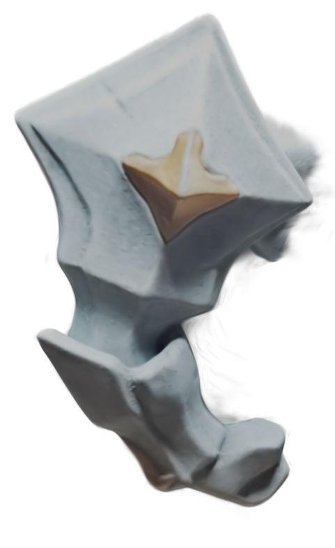{height=1.9in} | {height=1.9in} | 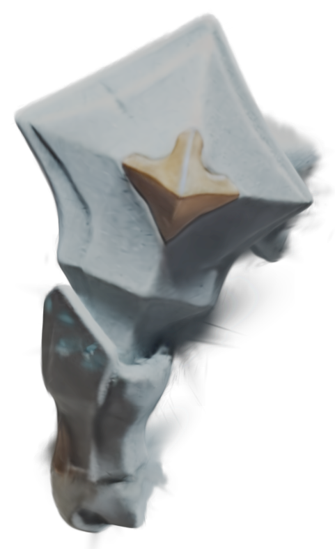{height=1.9in} |
| 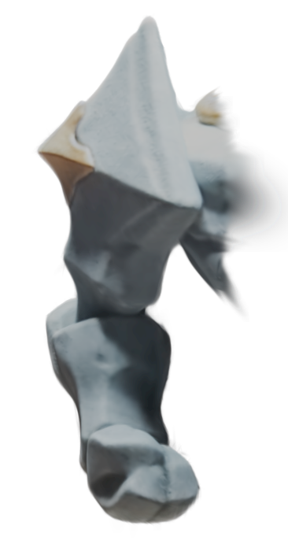{height=1.9in} | {height=1.9in} | 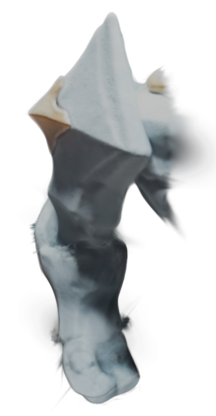{height=1.9in} |
| 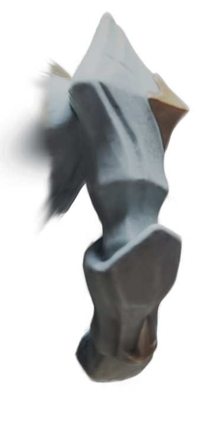{height=1.9in} | {height=1.9in} | 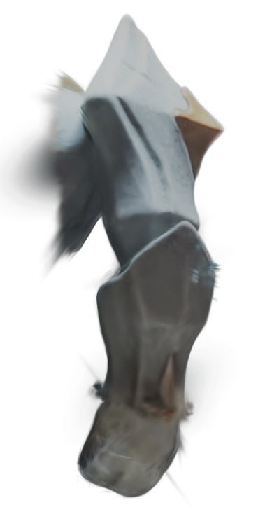{height=1.9in} |

: Three identical camera views (rows) of the toy-arm splat under each condition. The deformed splat without gaussian splitting shows stretching and bloating near the elbow joint; with EVSplitting applied (local lambda 1.5, no global lambda) these artifacts are visibly reduced.

### Lambda Sensitivity

Preliminary observations indicate that the lambda threshold has a meaningful impact on both visual quality and gaussian count. A strict lambda produces finer gaussians and smoother deformation at the cost of increased splat density. A lenient lambda preserves the original gaussian count but may leave artifacts in high-deformation regions. The dual global/local lambda scheme is intended to offer a practical middle ground, though systematic evaluation of this trade-off remains future work.

## Future Work

While this solution proves to be effective, comppute reamains a significant constraint in splitting up gaussians. Thus, we cannot split all large gaussians without cost of splitting and rendering the splat increasing exponentially. This is why there are still artifacts that persist (as in the above images). Thus, my focus during the upcoming semester will be on optimisation of the existing processes to ensure that deformation is done seamlessly

Below is the list items I intend to complete over the upcoming semester.

- [ ] Optimisation:
    - [ ] Improve performance of the binding and rendering processes to run on GPU
    - [ ] Remove transparent gaussians (/highly translucent)
    - [ ] Pre-compute splits at different lambdas before the user has decided where to do binding
- [ ] Detection of problematic gaussians given a particular armature
- [ ] Improve UI elements to integrate more cleanly into blender
- [ ] Fix small bugs in viewport rendering 
- [ ] Evaluation: 
    - [ ] A way to systematically evaluate artifacts in:
        - [ ] Skeleton based methods (LBS, DQS)
        - [ ] Non-rigid deformation
    - [ ] Metrics
        - [ ] Against sythetic examples
        - [ ] Cage based methods
- [ ] Relighting of Gaussians (this can be an orthogonal problem, although spherical harmonics are being updated using the existing code so this might be fairly straightforward)

\newpage

## Minutes of Meetings

### Minutes of 1st Project Meeting

**Date:** Wednesday, February 18, 2026\
**Time:** 02:00 pm HKT\
**Place:** Room 3504\
**Present:** Dr SANDER Pedro, VENKET Hrsh\
**Apology:** Dr MA Li\
**Note-taker:** VENKET Hrsh

#### 1. Approval of Minutes
Done by Dr SANDER after the meeting via zoom

#### 2. Discussion items
- Literature review done by VENKET Hrsh, which he got clarified by Dr SANDER Pedro
- Traingle Splatting vs Rigging with Gaussian Splatting. VENKET Hrsh prefered the idea of working on building a production system to do Rigging with Gaussian Splatting.
- Tech Stack for the capstone will probably be with OpenGL and Three.js (or some framework built on top. VENKET Hrsh mentioned having started learning Javascript and that he would be ready with the basics of Three.js by the next meeting
- Decided that the goal is to build a working product by the end of the Capstone Project
- Agreed on a rough **timeline for the capstone project**:
    1. Spend the first month doing a literature review
    2. Decide on a specific direction for implementation and have a working prototype in time for the interim report
    3. Refine the product during the summer semester and in time for the final report
- Decided on a time for weekly meetings Fridays at 03:00 pm via zoom
- [ ] Deliverable: Decide on the exact direction of the capstone project by the end of the next meeting, after reviewing literature

#### 3. Meeting adjournment and next meeting
Meeting Adjourned at 02:45 pm, next meeting will be held on 27th February

\newpage

### Minutes of 2nd Project Meeting

**Date:** Friday, February 27, 2026\
**Time:** 03:00 pm HKT\
**Place:** Zoom\
**Present:** Dr SANDER Pedro, Dr MA Li, VENKET Hrsh\
**Apology:** None\
**Note-taker:** VENKET Hrsh

#### 1. Approval of Minutes
Done by Dr SANDER and Dr Ma Li on Github

#### 2. Discussion items
- Discussed lit reviewed done by VENKET Hrsh.
- Decided direction of the project would be to focus on building a tool to do rigging (manually) with guassian splats directly onto a skeleton
- [ ] Deliverable: Decide whether an unreal engine/blender plugin are viable to make
- [ ] Deliverable: Otherwise, look into adjusting this web-based engine: https://github.com/playcanvas/supersplat

#### 3. Meeting adjournment and next meeting
Meeting Adjourned at 02:45 pm, next meeting will be held on 6th March.

\newpage

### Minutes of 3rd Project Meeting

**Date:** Friday, March 6, 2026\
**Time:** 05:00 pm HKT\
**Place:** Zoom\
**Present:** Dr SANDER Pedro, Dr MA Li, VENKET Hrsh\
**Apology:** None\
**Note-taker:** VENKET Hrsh

#### 1. Approval of Minutes
Done by Dr SANDER and Dr Ma Li on Github

#### 2. Discussion items
- Decided that the goal of the project would be to make a 3dgs rigging plugin that builds on top of the plugin: https://github.com/Kiri-Innovation/3dgs-render-blender-addon
- Discussed the structure of the plugin and the suggested extensions (as noted in ./Plan.md)
- [ ] Deliverables for future meetings are updated on ../Plan.md from now on and reflect in the commit history

#### 3. Meeting adjournment and next meeting
Meeting Adjourned at 05:45 pm, next meeting tentatively scheduled for 13th March.

\newpage

### Minutes of 4th Project Meeting

**Date:** Friday, March 13, 2026\
**Time:** 03:00 pm HKT\
**Place:** Zoom\
**Present:** Dr SANDER Pedro, VENKET Hrsh\
**Apology:** Dr MA Li\
**Note-taker:** VENKET Hrsh

#### 1. Approval of Minutes
Done by Dr SANDER on Github

#### 2. Discussion items
- Discussed progress on refactoring
- Agreed to update the plan to have one more week for refactoring
- [ ] Look into a suitable plan for how to implement GUI based rigging of gaussian splats and plan.

#### 3. Meeting adjournment and next meeting
Meeting Adjourned at 12:00 pm, next meeting tentatively scheduled for 23th March.

\newpage

### Minutes of 5th Project Meeting

**Date:** Friday, March 13, 2026\
**Time:** 12:00 pm HKT\
**Place:** Zoom\
**Present:** VENKET Hrsh, WANG Xuezhen\
**Apology:** Dr MA Li, Dr SANDER Pedro\
**Note-taker:** VENKET Hrsh

#### 1. Approval of Minutes
Done by Xuezhen on Github

#### 2. Discussion items
- Hrsh completed refactor and made a pull request to the original repository to merge the refactor
- Covered the TO-DOs added to the plugin
- Discussed the paper (https://yihua7.github.io/SC-GS-web/materials/SC_GS_Arxiv.pdf) as a model for rigging
    - Agreed that the model for controlling GS would not work for this project
- Discussed how GS are treated in the plugin as Vertex Meshes with special properties
    - Thus, each gaussian is treated as a blender vertex with special properties
    - In Blender, vertices can be natively rigged to bones
    - Changes would involve:
        - Updating uhow Gaussians are rendered to shift position and rotation if the rigged bones move
        - Create a UI for rigging and painting gaussians (try to integrate with existing blender UI)
- Updated the plan for the project (noted in Plan.md)
    - Agreed on directly rigging the splats and updating their position based on rigged bones
    - Agreed on using CPU rendering of gaussians in each keyframe as a prototype
    - Xuezhen suggested that rotation of gaussians can be ignored for the first prototype

#### 3. Meeting adjournment and next meeting
Meeting Adjourned at 12:20 pm, next meeting tentatively scheduled for 10th April.

\newpage

### Minutes of 6th Project Meeting

**Date:** Friday, March 27, 2026\
**Time:** 12:00 pm HKT\
**Place:** Zoom\
**Present:** VENKET Hrsh, WANG Xuezhen, Dr MA Li, Dr SANDER Pedro\
**Note-taker:** VENKET Hrsh

#### 1. Approval of Minutes
Done by Xuezhen, Dr MA Li, and Dr SANDER Pedro on Github

#### 2. Discussion items
- This meeting was a repeat of the 5th meeting with Xuezhen
- Hrsh completed refactor and made a pull request to the original repository to merge the refactor
- Covered the TO-DOs added to the plugin
- Discussed the paper (https://yihua7.github.io/SC-GS-web/materials/SC_GS_Arxiv.pdf) as a model for rigging
    - Agreed that the model for controlling GS would not work for this project
- Discussed how GS are treated in the plugin as Vertex Meshes with special properties
    - Thus, each gaussian is treated as a blender vertex with special properties
    - In Blender, vertices can be natively rigged to bones
    - Changes would involve:
        - Updating uhow Gaussians are rendered to shift position and rotation if the rigged bones move
        - Create a UI for rigging and painting gaussians (try to integrate with existing blender UI)
- Updated the plan for the project (noted in Plan.md)
    - Agreed on directly rigging the splats and updating their position based on rigged bones
    - Agreed on using CPU rendering of gaussians in each keyframe as a prototype
    - Xuezhen suggested that rotation of gaussians can be ignored for the first prototype

#### 3. Meeting adjournment and next meeting
Meeting Adjourned at 12:20 pm, next meeting is scheduled for 13th April.

\newpage

### Minutes of 7th Project Meeting

**Date:** Monday, April 13, 2026\
**Time:** 12:00 pm HKT\
**Place:** Zoom\
**Present:** VENKET Hrsh, WANG Xuezhen, Dr MA Li, Dr SANDER Pedro\
**Note-taker:** VENKET Hrsh

#### 1. Approval of Minutes
Done by Xuezhen, Dr MA Li, and Dr SANDER Pedro on Github

#### 2. Discussion items
- Hrsh discussed updates and demos he had shared on zoom
    - Direct rigging of Gaussian Splats on bones
    - Alternative approach of Rigging Gaussians onto a rigged mesh
- Suggestions to improve the results
    - Add scaling of gaussians based on the affine transformation of mesh triangles
    - Add a UI to visualise 'weights' directly on gaussians and give a way to separately adjust these
    - Fix the viewport order of rendering of gaussians

#### 3. Meeting adjournment and next meeting
Meeting Adjourned at 12:20 pm, next meeting is scheduled for 9:30 AM on April 27th Monday.

\newpage

### Minutes of 8th Project Meeting

**Date:** Monday, April 27, 2026\
**Time:** 09:30 AM HKT\
**Place:** Zoom\
**Present:** VENKET Hrsh, WANG Xuezhen, Dr MA Li, Dr SANDER Pedro\
**Note-taker:** VENKET Hrsh

#### 1. Approval of Minutes
Done by Xuezhen, Dr MA Li, and Dr SANDER Pedro on Github

#### 2. Discussion items
- Hrsh discussed updates and demos he had shared on zoom
    - Add scaling of gaussians based on the affine transformation of mesh triangles
    - Fix the viewport order of rendering of gaussians
    - Fix a bug where rotation to make rotation changes idempotent
- Discuss GaussiAnimate paper (https://arxiv.org/abs/2604.08547)
- Discuss future deliverables
    - [X] System for improving the binding of gaussians to proxy mesh
        - Penalty for mapping gaussians to parts of mesh topology that are far apart
        - Priority queue for 'label propogation' like system of assigning gaussians
        - Remeshing where needed
        - Selective 'spltting' of gaussians
    - [X] Handling spltting of gaussians:
        - [X] (above mentioned) Splitting when nearest mesh triangle is uncertain)
        - [X] Splitting as a result of movement of gaussian
    - [X] Create a better quality splat to demonstrate and test results on
    - [ ] Combining of Gaussians where possible based on reposed gaussians (based on NanoGS)

#### 3. Meeting adjournment and next meeting
Meeting Adjourned at 10:15 pm

\newpage

### Minutes of 9th Project Meeting

**Date:** Friday, May 15, 2026\
**Time:** 10:00 AM HKT\
**Place:** Zoom\
**Present:** VENKET Hrsh, WANG Xuezhen, Dr MA Li, Dr SANDER Pedro\
**Note-taker:** VENKET Hrsh

#### 1. Approval of Minutes
Done by Xuezhen, Dr MA Li, and Dr SANDER Pedro on Github

#### 2. Discussion items
- Hrsh discussed updates of his work
    - System for improving the binding of gaussians to proxy mesh
        - Penalty for mapping gaussians to parts of mesh topology that are far apart
        - Priority queue for 'label propogation' like system of assigning gaussians
        - Selective 'spltting' of gaussians
    - Handling spltting of gaussians:
        - Split Gaussians using a closed form solution based on ratio of largest scale of gaussian and radius of circumcircle
    - Create a better quality splat to demonstrate and test results on

Overall workflow:

1. Create and upload splat and proxy mesh
2. Edit the splat and mesh on blender
3. Create an armature
4. Decide on areas which require better resolution and:
    a. subdivide those areas on mesh
    b. 'Mark' those areas on the GS (Added)
        i. Set a global and 'strict' lambda for the gaussians (Added)
5. Paint weights on the proxy-mesh (4 and 5 are interchangable)
6. Bind GS to proxy mesh (Added)
    a. Select Proxy mesh then select GS
    b. Press Bind
        i. Priority queue of gaussians (priority: difference between closest and second closest triangle + penalty). Decide first gaussians and corresponding triangle based difference in distance alone. If largest scale of gaussian > lambda * radius of circumcircle of triangle:
            - 'Split' this gaussian into two using closed form solution. Lambda metric based on https://arxiv.org/pdf/2402.04796; closed form solution based on https://cg.cs.tsinghua.edu.cn/papers/SIGASIA-2024-EVSplitting.pdf. Preserve alpha of gaussians on split. Max 8 loops for now, will look into efficiency
            - Add the split gaussians to the priority queue (leave them unbound to any triangle)
        ii. Binding is done by orthographic projection onto closest triangle (mesh surface)
        iii. After binding gaussians, when corresponding mesh face (triangle) is updated, update the Gaussian's scaling (via affine transform on the corresponding mesh face), rotation, and positions
7. Pose armature to control the GS
8. Redo above steps as needed

- TODO:
    - [X] Write report
        - [X] Side-by-side figures
        - [X] What is novel (demonstrate contributions in a taxonomy)
- TODO For next semester:
    - [ ] Clean up issues with viewport, finetune the binding to be a little cleaner
    - [ ] Merge / un-split gaussians as needed
        - [ ] precompute splits and spit only when needed
        - [ ] Alternative: compute splits at different lambdas
        - [ ] Detecting of relative blurriness of the mesh
        - [ ] checking blurriness of items
    - [ ] Evaluation of the method
        - [ ] Skeleton based methods
        - [ ] Non-rigid deformation examples
        - [ ] Metrics:
            - [ ] Against sythetic examples
            - [ ] Cage based methods
    - [ ] Editing appearance of the gaussian
    - [ ] Optimisation of existing operations to be on GPU/paralellised
    - [ ] Relighting can be an orthogonal problem

#### 3. Meeting adjournment and next meeting
Meeting Adjourned at 10:15 pm
